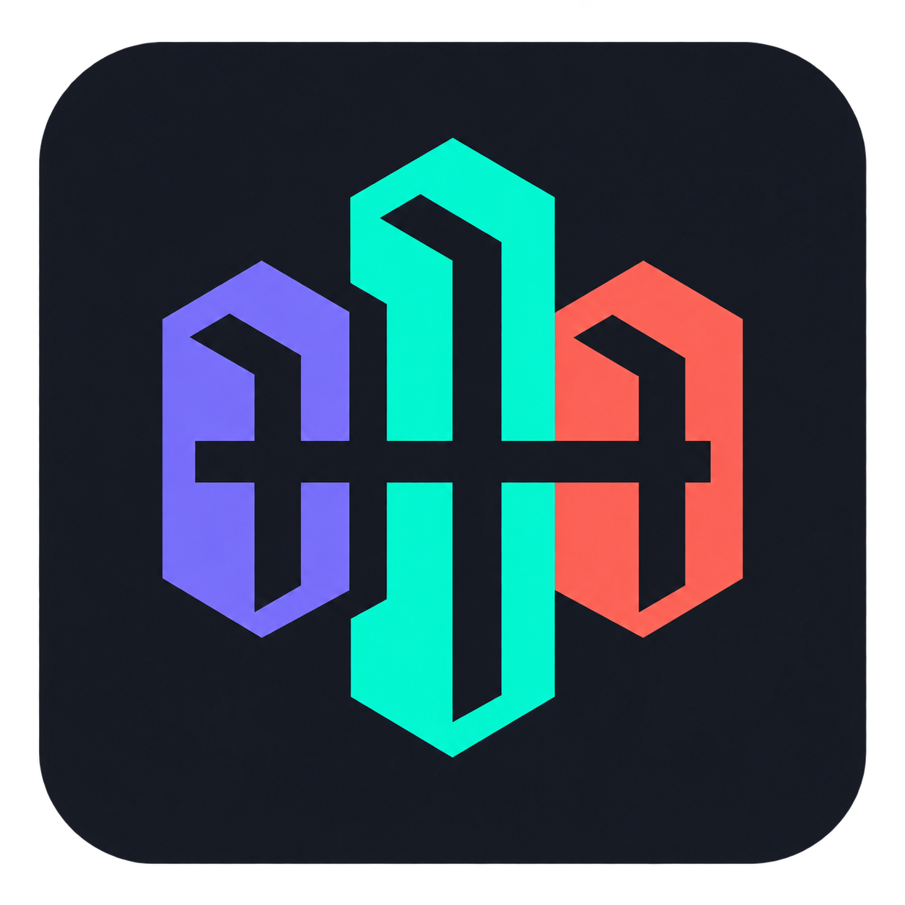

# MinusPodJev

MinusPodJev is a FastAPI proxy that makes TypeSafe Jev available to [MinusPod](https://github.com/ttlequals0/MinusPod) as an OpenAI-compatible ad-detection model. This repository also contains the standalone offline benchmark that measured Jev against 84 chat models on a 14-episode corpus.

## Contents

- [Features](#features)
- [How it works](#how-it-works)
- [Requirements](#requirements)
- [Quick start](#quick-start)
- [Documentation](#documentation)
- [License](#license)
- [LLM disclosure](#llm-disclosure)

## Features

- OpenAI-compatible detection, verification, and review endpoints for MinusPod
- Native Jev segments-in, spans-out endpoint
- Optional sponsor matching from MinusPod's sponsor list, with a gazetteer fallback
- Runtime threshold settings and a status page with process-scoped metrics
- Offline benchmark corpus, caches, reports, and reproduction commands

## How it works

Jev scores one transcript segment at a time. The proxy parses MinusPod's window prompt, asks Jev one noul per segment, assembles spans, classifies categories, matches sponsors, and returns MinusPod's expected JSON envelope. The full request flow and component diagram are in [How it works](docs/how-it-works.md).

Jev Proxy does not support chapter generation. Chapter titles still need a secondary chat model.

Jev Proxy is a POC shim. It does not change the MinusPod runtime that controls holds, autoapproval, or verification logs. `compat/minuspod_compat` is a vendored snapshot used by the production proxy and offline benchmarks. Keep production operations in the existing MinusPod application until Jev is mature.

## Requirements

- Docker and Docker Compose for the container deployment
- A TypeSafe key supplied by MinusPod as its OpenAI bearer token
- `MINUSPOD_BASE_URL` and `MINUSPOD_PASSWORD` for live sponsor naming
- `MINUSPOD_PASSWORD` for runtime-settings editing

For local development, use Python 3.11+ and `uv`. See [Installation](docs/installation.md).

## Quick start

The included Compose file starts `ttlequals0/minuspodjev:latest`, persists runtime settings in the `jevproxy-data` volume, and binds `127.0.0.1:8080` by default.

```bash
docker compose up -d
```

1. Set `MINUSPOD_BASE_URL` and `MINUSPOD_PASSWORD` in the Compose environment for live sponsor naming. Set `MINUSPOD_PASSWORD` for runtime-settings editing.
2. Point MinusPod's primary detection and verification provider at `http://<proxy-host>:8080/v1`. Use `openai_compatible`, `typesafe/jev`, and `timestamps` addressing. The [provider fields table](docs/configuration.md#provider-fields) has the full configuration.
3. Configure an independent secondary chat model for review and chapter titles.

MinusPod supplies the TypeSafe key on each request; do not normally set a fallback key in Compose.

`http://localhost:8080/` is the status UI from the Docker host. The default loopback binding requires explicit exposure before a remote MinusPod can call the proxy. For intentional LAN or reverse-proxy exposure, set `JEVPROXY_BIND_ADDRESS=0.0.0.0` and provide appropriate network access controls. See [Configuration](docs/configuration.md) and [Installation](docs/installation.md).

## Documentation

| Topic | |
|---|---|
| [How it works](docs/how-it-works.md) | Request flow, supported phases, architecture, and repository layout |
| [Installation](docs/installation.md) | Local development and Docker Compose setup |
| [Web interface](docs/web-interface.md) | Status page, settings editor, and runtime statistics |
| [Configuration](docs/configuration.md) | MinusPod routing, thresholds, and runtime behavior |
| [Environment variables](docs/environment-variables.md) | Environment variable reference |
| [API](docs/api.md) | OpenAI-compatible, native, status, settings, and documentation endpoints |
| [Security and storage](docs/security-and-storage.md) | Authentication, secrets, request limits, cache, and persistence |
| [Benchmark](docs/benchmark.md) | Reproduction commands, reports, corpus, and result caveats |

Browse the [full documentation index](docs/README.md).

## License

[MIT](LICENSE)

## LLM disclosure

This project was developed using AI agents as a pair programmer. It was NOT vibe coded. For context, I'm a systems engineer who also writes code professionally with 15+ years of experience. The codebase follows engineering best practices, and all architecture and design decisions were made by me, not by AI. All code generated by LLMs was reviewed and tested by me, a human.
