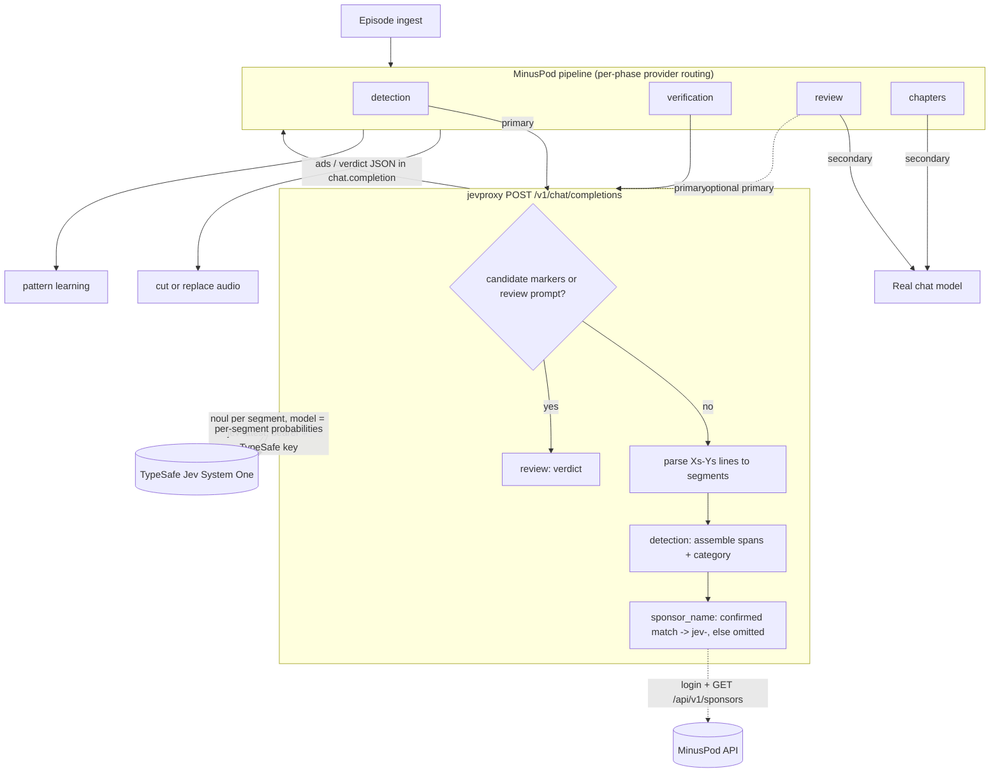

# MinusPodJev

Two things live here:

1. **jevproxy** (`backend/`) - a FastAPI service that makes TypeSafe Jev look like an OpenAI
   chat model, so [MinusPod](https://github.com/ttlequals0/MinusPod) can detect ads with Jev
   instead of a chat LLM.
2. **benchmark** (`benchmark/`) - the offline harness that measured Jev against 84 chat
   models on a 14-episode corpus, with the caches and reports. Runs standalone with `uv`.

Full writeup: `JEV_BENCHMARK_REPORT.md`. Short version: Jev ties the best chat model within
noise at ~36x lower cost and ~59x lower latency, never cuts ad-free audio, but cuts a whole
segment at a time when wrong. It does not beat chat models on accuracy at strict IoU or after
cross-validating its tuned thresholds.

## Flow



## jevproxy

Jev scores one segment at a time ("is this line an ad?"); the client assembles the spans.
The proxy wraps that as an OpenAI chat endpoint: parse MinusPod's window prompt into
segments, ask Jev one noul per segment, assemble spans, run a second pass for category, name
sponsors from MinusPod's sponsor list (gazetteer fallback), and return the `{"ads": [...]}`
JSON in a chat-completion envelope.

One `/chat/completions` handler covers three of MinusPod's four LLM phases:

- **detection** - the window prompt.
- **verification** - re-detection on the re-cut audio, same prompt, handled identically.
- **review** - per-ad prompts (marked `>>> CANDIDATE AD START` / `<<< CANDIDATE AD END`) get
  Jev's verdict schema (is_ad, boundaries, confidence), including resurrection candidates.

> Note: Jev Proxy does not support chapter generation. You still need a chat model for
> chapter titles. Configure a secondary chat-model provider and set `chapters_provider` to
> `secondary`; do not route chapter generation to this proxy.

Endpoints:
- `POST /v1/chat/completions`, `POST /chat/completions` - the OpenAI surface MinusPod calls
  (with and without `/v1`); routes detection/verification/review by prompt
- `GET /v1/models`, `GET /models` - advertise `typesafe/jev`
- `POST /api/v1/jev/ask` - native segments-in, spans-out
- `GET /api/status`, `GET /api/health`, `GET /api/docs`

### Pointing MinusPod at it (settings only, no app-code change)

MinusPod routes a provider per phase (`llm_route.py`). Set the detection and verification
provider to the proxy (`openai_compatible`, your proxy's base URL, model `typesafe/jev`,
addressing mode `timestamps`, API key = your **TypeSafe key**, which the proxy forwards to Jev).
For independent review, you can configure a separate chat model as the secondary provider for
review and chapter titles. This is a recommended POC configuration, not a change applied to
MinusPod by this repository.

The caller's system policy is forwarded unchanged to Jev's detection and category classification
guidance. This shim does not impose text, segment, or request-body caps and never truncates the
prompt; Jev enforces its current model limits upstream. External network components may enforce
their own limits outside this shim. See the [Jev model limits](https://docs.typesafe.ai/models)
and [API documentation](https://docs.typesafe.ai/api) for the current upstream contract.

| phase | provider slot | goes to |
|---|---|---|
| `detection_provider` | primary | proxy -> Jev |
| `verification_provider` | primary | proxy -> Jev |
| `review_provider` | secondary | independent chat model |
| `chapters_provider` | secondary | a real chat model |

`typesafe/jev` maps to the upstream Jev model internally. A request with neither a caller
bearer token nor `TYPESAFE_API_KEY` is rejected with 503. When a fallback key is configured,
a bearer token is still required unless `JEV_ALLOW_UNAUTHENTICATED_FALLBACK=true`.

Jev review remains available when routed to the proxy, but it is correlated with Jev detection
and is not an independent judgment. An unavailable Jev review returns 503 and does not confirm
or move the candidate. Sponsor naming: set `MINUSPOD_BASE_URL` +
`MINUSPOD_PASSWORD` and the proxy logs into MinusPod (cached session) to read
`GET /api/v1/sponsors`. It emits `sponsor_name` only for one known sponsor with local ad
evidence, using the `jev-` namespace, for example `jev-ButcherBox`. The prefix identifies a
proxy-generated learned record and the suffix is the matched canonical brand; an unmatched span
leaves the field absent, preventing false sponsor evidence. Its `Based on transcript:` rationale
quotes source evidence rather than synthetic ad wording, and the compatibility parser recognizes
it as rationale. Unset `MINUSPOD_BASE_URL` falls back to the gazetteer.

### MinusPod runtime ownership

Jev Proxy is a POC shim. It does not change the MinusPod runtime that controls holds,
autoapproval, or verification logs. `compat/minuspod_compat` is an import-free snapshot used
only for offline validation. Keep production operations in the existing MinusPod application
until Jev is mature.

### Request safety and cache

- A caller bearer token is required by default and is forwarded as the TypeSafe key. Set
  `JEV_ALLOW_UNAUTHENTICATED_FALLBACK=true` only for a protected internal deployment that must
  permit a configured `TYPESAFE_API_KEY` without a caller bearer token.
- Requests are bounded by `JEV_MAX_CONCURRENT_REQUESTS=4` per worker. The Docker default of 1
  worker permits up to 4 concurrent requests. The shim does not apply text, segment,
  or request-body limits; Jev enforces its current upstream model limits.
- `JEV_REQUEST_DEADLINE_SECONDS=75` is a cooperative request budget covering retries and retry
  waits. Keep it below nginx's 90 second response-inactivity timeout when changing either value.
- `JEV_CACHE_PATH` is retained as the legacy JSON import source. Active responses are stored in
  a SQLite sidecar beside it and capped at `JEV_CACHE_MAX_ENTRIES=10000` entries. Failed sponsor
  refreshes pause for `SPONSOR_FAILURE_COOLDOWN_SECONDS=900` seconds before another attempt.
  This cooldown is per worker, so account for workers and replicas against MinusPod's login limit.

### Runtime metrics

`GET /api/stats` reports ephemeral metrics for the responding process. Docker defaults to one
worker so its totals describe the container. If `WORKERS` is raised above one, the response remains
process-scoped and is not a container-wide aggregate. `scope.configured_workers` is only the
parseable `WORKERS` environment hint, or `null` when unavailable. Metrics reset on process restart.

- `proxy_requests` counts only inference endpoints and measures proxy handling from request receipt
  to response headers. Health, models, status, and stats requests are excluded.
- `jev_http` counts every actual upstream POST, including retry attempts. Its latency is the Jev
  HTTP attempt time, not the full MinusPod request path.
- `cache` separates cache hits and misses. `cost.estimated_input_usd` charges only successful,
  uncached upstream responses with valid reported input tokens, at Jev's published $0.042 per
  million input tokens. It is an estimate and excludes output token charges, fees, and taxes.

### Run it

Requires `uv` and Python 3.11+.

```bash
cp .env.example .env    # TYPESAFE_API_KEY optional; MinusPod sends it per request
uv sync
uv run uvicorn app.main:app --app-dir backend --reload
uv run pytest backend/tests -q   # upstream calls mocked; no network
```

### Ports, status, logging

- The app (uvicorn) listens on 8000; in the container nginx listens on 8080 and proxies
  `/api`, `/v1`, `/chat/completions`, and `/models` to it. Point MinusPod at
  `http://<proxy>:8080/v1` (or `http://localhost:8000/v1` running uvicorn directly).
- Outbound: HTTPS to `api.typesafe.ai` (Jev) and `MINUSPOD_BASE_URL` (sponsors).
- `GET /api/status` reports whether Jev and MinusPod are reachable and whether a MinusPod
  session is active, using cheap probes only (no billable Jev call, no login), so it is safe
  to poll. `GET /api/health` is liveness.
- `GET /api/stats` is available immediately after startup. It reports one process's proxy and
  upstream-attempt counts, latency, cache activity, uptime, and an estimated input cost. It
  resets on restart and is not a container-wide total when multiple workers are configured. The
  configured-worker field is an optional environment hint, not a discovered worker count.
  Proxy handling time is receive-to-response, not full MinusPod round-trip time; Jev timing is
  per upstream HTTP attempt, including retries. Estimated cost includes only successful uncached
  calls with valid upstream input-token usage. Cache hits do not call Jev; failed cache
  fetches are cache misses.
- Logs go to stdout at `LOG_LEVEL` (`DEBUG` for verbose tracing). The TypeSafe key, MinusPod
  password, session cookies, and Authorization header are never logged.
- The included status page uses `/api/health` and `/api/status` directly. It reports live
  reachability and performs no inference or MinusPod login.

### Status page

Served at the proxy root (`http://<proxy>:8080/`), with an Overview and a Runtime stats view
and a manual Refresh.


- **Connections** - three cards: Proxy (health, environment, version), TypeSafe Jev
  (connection, host), and MinusPod (connection, host, session).
- **Runtime stats** - process-scoped counters from `/api/stats`: proxy calls, average proxy
  handling time, Jev HTTP attempts, average Jev round-trip, cache hit rate, estimated input
  cost, process uptime, and configured workers. Counters reset when the process restarts and
  are per worker, not a container-wide total.

### Docker Compose exposure

`docker compose up -d` publishes `127.0.0.1:8080` by default, so only the host can reach the
proxy. For intentional LAN or reverse-proxy exposure, set `JEVPROXY_BIND_ADDRESS=0.0.0.0` in
your environment and provide appropriate network access controls.

## benchmark

Runs from `benchmark/` with its own `uv` project, reusing the vendored MinusPod pieces in
`compat/` (windows, ad schema, sponsor gazetteer, pricing) so it needs no MinusPod checkout.

```bash
cd benchmark
uv sync
uv run pytest -q                                   # 298 tests
uv run benchmark jev-spike --oracle off --passes 1 # reproduces F0.5 0.957 from cache
uv run benchmark combined-report --jev-passes 1    # regenerates results/report-combined.md
```

Reports and data under `benchmark/results/`:
- `report-combined.md` - Jev and Jev-ceiling ranked against all 84 chat models, with an
  `F0.5 @0.8` column beside the headline `F0.5 @0.5`
- `report.md` - the segment_ids-mode report
- `audit-2026-09-19.md` - the working investigation log
- `raw/jev_cache.json` - Jev probabilities, 1026 entries (1-pass + 5-pass, live)
- `raw/haiku_persegment_cache.json` - Haiku through Jev's decomposition (the ablation)

`jev-spike` and `combined-report` read the cache, so reruns cost nothing; a fresh run needs
`TYPESAFE_API_KEY`.

## Layout

- `backend/app/` - the proxy: `api/` routers, `services/` (Jev calls, detection, review,
  sponsors), `openai_adapter.py` (prompt parsing and the ads/verdict envelope)
- `compat/minuspod_compat/` - vendored MinusPod code the proxy and benchmark share
- `benchmark/` - the evaluation harness, corpus, caches, and reports
- `frontend/`, `deployment/`, `docker-compose.yml` - status page and container stack
- `JEV_BENCHMARK_REPORT.md` - the test report

## LLM disclosure

This project was developed using AI agents as a pair programmer. It was NOT vibe coded. For context, I'm a systems engineer who also writes code professionally with 15+ years of experience. The codebase follows engineering best practices, and all architecture and design decisions were made by me, not by AI. All code generated by LLMs was reviewed and tested by me, a human.
