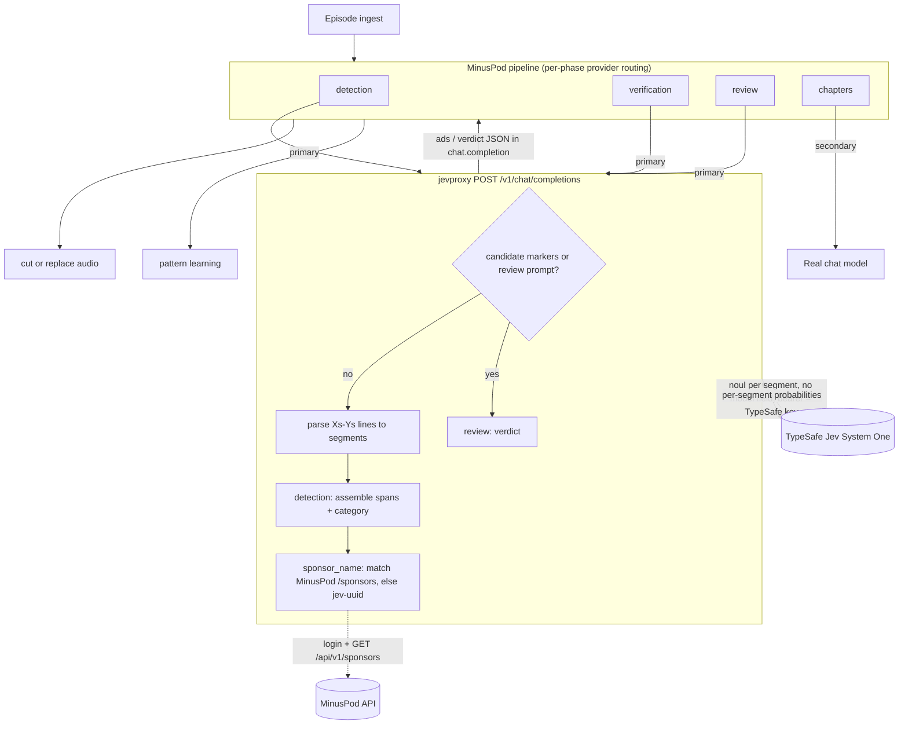

# MinusPodJev

Two things live here:

1. **jevproxy** (`backend/`) - a FastAPI service that makes TypeSafe Jev look like an OpenAI
   chat model, so MinusPod can detect ads with Jev instead of a chat LLM.
2. **benchmark** (`benchmark/`) - the offline harness that measured Jev against 84 chat
   models on a 14-episode corpus, with the caches and reports. Runs standalone with `uv`.

Full writeup: `JEV_BENCHMARK_REPORT.md`. Short version: Jev ties the best chat model within
noise at ~36x lower cost and ~59x lower latency, never cuts ad-free audio, but cuts a whole
segment at a time when wrong. It does not beat chat models on accuracy at strict IoU or after
cross-validating its tuned thresholds.

## Flow



## jevproxy

Jev scores one segment at a time ("is this line an ad?"); the client assembles the spans.
The proxy wraps that as an OpenAI chat endpoint: parse MinusPod's window prompt into
segments, ask Jev one noul per segment, assemble spans, run a second pass for category, name
sponsors from MinusPod's sponsor list (gazetteer fallback), and return the `{"ads": [...]}`
JSON in a chat-completion envelope.

One `/chat/completions` handler covers three of MinusPod's four LLM phases:

- **detection** - the window prompt.
- **verification** - re-detection on the re-cut audio, same prompt, handled identically.
- **review** - per-ad prompts (marked `>>> CANDIDATE AD START` / `<<< CANDIDATE AD END`) get
  Jev's verdict schema (is_ad, boundaries, confidence); resurrection too. Trim-recovery needs
  generation, so it degrades to a no-change verdict.

The fourth phase, chapter generation, is generative and Jev cannot do it, so chapters route
to a real model (see the table).

Endpoints:
- `POST /v1/chat/completions`, `POST /chat/completions` - the OpenAI surface MinusPod calls
  (with and without `/v1`); routes detection/verification/review by prompt
- `GET /v1/models`, `GET /models` - advertise `typesafe/jev`
- `POST /api/v1/jev/ask` - native segments-in, spans-out
- `GET /api/status`, `GET /api/health`, `GET /api/docs`

### Pointing MinusPod at it (settings only, no app-code change)

MinusPod routes a provider per phase (`llm_route.py`). Set the **primary** provider to the
proxy (`openai_compatible`, your proxy's base URL, model `typesafe/jev`, addressing mode
`timestamps`, API key = your **TypeSafe key**, which the proxy forwards to Jev). Set a
**secondary** provider to a real chat model for chapters.

| phase | provider slot | goes to |
|---|---|---|
| `detection_provider` | primary | proxy -> Jev |
| `verification_provider` | primary | proxy -> Jev |
| `review_provider` | primary | proxy -> Jev |
| `chapters_provider` | secondary | a real chat model |

`typesafe/jev` maps to the upstream Jev model internally; the proxy returns 503 only if
neither a bearer token nor `TYPESAFE_API_KEY` is present.

Sponsor naming: set `MINUSPOD_BASE_URL` + `MINUSPOD_PASSWORD` and the proxy logs into MinusPod
(cached session) to read `GET /api/v1/sponsors`, matching name and aliases into
`sponsor_name`. No match gets a unique `jev-<7char>` placeholder, so pattern learning never
clusters unnamed ads. Unset `MINUSPOD_BASE_URL` falls back to the gazetteer.

Review tunables (`config.py`): the review route reuses `JEV_ENTER`/`JEV_STAY` and emits Jev's
segment-edge boundaries, so a disagreement reads as "adjust" (MinusPod clamps it). Switch to
confirm-in-place to never move a boundary.

### Run it

Requires `uv` and Python 3.11+.

```bash
cp .env.example .env    # TYPESAFE_API_KEY optional; MinusPod sends it per request
uv sync
uv run uvicorn app.main:app --app-dir backend --reload
uv run pytest backend/tests -q   # upstream calls mocked; no network
```

### Ports, status, logging

- The app (uvicorn) listens on 8000; in the container nginx listens on 8080 and proxies
  `/api`, `/v1`, `/chat/completions`, and `/models` to it. Point MinusPod at
  `http://<proxy>:8080/v1` (or `http://localhost:8000/v1` running uvicorn directly).
- Outbound: HTTPS to `api.typesafe.ai` (Jev) and `MINUSPOD_BASE_URL` (sponsors).
- `GET /api/status` reports whether Jev and MinusPod are reachable and whether a MinusPod
  session is active, using cheap probes only (no billable Jev call, no login), so it is safe
  to poll. `GET /api/health` is liveness.
- Logs go to stdout at `LOG_LEVEL` (`DEBUG` for verbose tracing). The TypeSafe key, MinusPod
  password, session cookies, and Authorization header are never logged.

## benchmark

Runs from `benchmark/` with its own `uv` project, reusing the vendored MinusPod pieces in
`compat/` (windows, ad schema, sponsor gazetteer, pricing) so it needs no MinusPod checkout.

```bash
cd benchmark
uv sync
uv run pytest -q                                   # 298 tests
uv run benchmark jev-spike --oracle off --passes 1 # reproduces F0.5 0.957 from cache
uv run benchmark combined-report --jev-passes 1    # regenerates results/report-combined.md
```

Reports and data under `benchmark/results/`:
- `report-combined.md` - Jev and Jev-ceiling ranked against all 84 chat models, with an
  `F0.5 @0.8` column beside the headline `F0.5 @0.5`
- `report.md` - the segment_ids-mode report
- `audit-2026-09-19.md` - the working investigation log
- `raw/jev_cache.json` - Jev probabilities, 1026 entries (1-pass + 5-pass, live)
- `raw/haiku_persegment_cache.json` - Haiku through Jev's decomposition (the ablation)

`jev-spike` and `combined-report` read the cache, so reruns cost nothing; a fresh run needs
`TYPESAFE_API_KEY`.

## Layout

- `backend/app/` - the proxy: `api/` routers, `services/` (Jev calls, detection, review,
  sponsors), `openai_adapter.py` (prompt parsing and the ads/verdict envelope)
- `compat/minuspod_compat/` - vendored MinusPod code the proxy and benchmark share
- `benchmark/` - the evaluation harness, corpus, caches, and reports
- `frontend/`, `deployment/`, `docker-compose.yml` - status page and container stack
- `JEV_BENCHMARK_REPORT.md` - the test report
