# MinusPod LLM Benchmark Report (addressing mode: segment_ids)

## Table of Contents

- [Metric Key](#metric-key)
- [TL;DR](#tldr)
- [Charts](#charts)
- [Failures and provider issues](#failures-and-provider-issues)
- [Precision, recall, and FP/FN breakdown](#precision-recall-and-fpfn-breakdown)
- [Boundary accuracy](#boundary-accuracy)
- [Confidence calibration](#confidence-calibration)
- [Latency tail](#latency-tail)
- [Output token efficiency](#output-token-efficiency)
- [Cost breakdown (input vs output)](#cost-breakdown-input-vs-output)
- [Trial variance (determinism check)](#trial-variance-determinism-check)
- [Cross-model agreement](#cross-model-agreement)
- [Detection rate by ad characteristic](#detection-rate-by-ad-characteristic)
- [Quick Comparison](#quick-comparison)
- [Detailed Results](#detailed-results)
- [Methodology](#methodology)
- [Transcript source](#transcript-source)
- [Run Metadata](#run-metadata)

## Metric Key

Quick reference for the columns in every table below.

| Metric | Range | Direction | What it means |
|--------|-------|-----------|---------------|
| **F1 (accuracy)** | 0 to 1 | higher is better | Combined score of precision and recall against the human-verified ground-truth ad spans. F1 = 0 means the model found nothing right; F1 = 1 means it found every ad with the correct boundaries. Uses IoU >= 0.5 (predicted span must overlap truth span by at least half) to count a match, after both sides are canonicalized to per-break spans. |
| **F0.5 @0.5 / F0.5 @0.8** | 0 to 1 | higher is better | The same F0.5 estimator at two IoU match thresholds. Ranking uses the @0.5 column; the @0.8 column re-scores the identical predictions where a match must line up on the boundaries, so a large drop between the two means the rank is an artifact of loose matching rather than accurate cuts. `n/a` means the row carries no strict-threshold scores. |
| **Cost / episode** | USD | lower is better | Average dollars per episode at the current pricing snapshot. Recomputed from token counts so all rows compare at the same prices regardless of when the call ran. |
| **F1 / $** | ratio | higher is better | F1 divided by cost-per-episode. Cheap accurate models score highest. Free-tier models (when the roster has any) are rank-listed separately because the ratio is undefined. |
| **p50 / p95 latency** | seconds | lower is better, with caveats | Median (p50) and tail (p95) wall-clock response time. **Note**: for models routed through OpenRouter (everything except `claude-*`), this includes OpenRouter's queueing and upstream-provider latency, not just the model itself. Treat as a load/availability indicator, not a model-quality signal. |
| **JSON compliance** | 0 to 1 | higher is better | Fraction of responses that parsed as a clean JSON array matching the requested schema. 1.0 = always clean; lower = used object wrappers (`{ads: [...]}`), markdown fences, extra fields like `sponsor`, or required regex fallback to extract. |
| **No-ad episode** | PASS / FAIL | PASS desired | Negative-control test on the 2 episode(s) verified to contain no ads (`ep-ai-cloud-essentials-e8dc897fbd6b`, `ep-oxide-and-friends-ce789ff5b62e`). PASS = zero predictions across all 16 of their windows. FAIL = the model false-positived on a non-ad segment, with the FP count shown. |
| **F1 stdev** | 0 to 1 | lower means more consistent | Standard deviation of F1 across the 12 ad-bearing episodes. High stdev = inconsistent across content types. |
| **Moderation blocked** | 0 to 100% | 0 desired | Share of attempted calls the provider refused on content grounds. Refused windows never reach scoring, so any non-zero value means that model's F1 was computed on a subset of the corpus and is not comparable to an unblocked row. |
| **JSON mode** | `native` / `prompt-inject` / `mixed` | -- | How the model received its JSON-output instruction. `native` = provider accepted `response_format=json_object` for at least 95% of calls; `prompt-inject` = provider rejected it and the runner fell back to instructing JSON in the prompt for at least 95% of calls; `mixed` = neither path crossed the threshold (sample mostly comes from intermittent provider rejections). Reads from `json_format_used` in `calls.jsonl`. Useful when picking a model whose provider may not support native JSON mode -- a strong `JSON compliance` score from a `prompt-inject` model carries different weight than the same score from a `native` model. |

### Glossary

- **IoU (intersection over union)**: how much two time ranges overlap, expressed as `(overlap) / (union)`. 0 means no overlap, 1 means identical ranges. We use IoU >= 0.5 as the threshold for a predicted ad to count as matching a truth ad.
- **Per-break canonicalization**: before matching, predicted and truth spans separated by gaps under 15 seconds are merged, so one span means one contiguous ad break. This mirrors the detection prompt's own merge rule; a model that reports one break as several adjacent spots is not penalized for the split.
- **Trial**: each (model, episode) pair runs 5 trials at temperature 0.0 to surface non-determinism. F1 numbers in tables are averaged across trials.
- **Window**: each episode is split into 600-second sliding windows at a 420-second stride, so consecutive windows overlap by 180 seconds; the model judges each window independently. Per-window predictions are stitched together for episode-level scoring.
- **Schema violations**: number of times the response had at least one missing-required-field, wrong-type, or extra-key issue. Doesn't tank F1, but signals brittleness.
- **Extraction method**: the route the parser took to recover the ad list. `json_array_direct` is the cleanest; method names with `regex_*` mean the JSON itself was malformed and we fell back to text matching.


## TL;DR

### Best Accuracy (F0.5 @ IoU >= 0.5)

Models ranked by F0.5 (precision weighted 2x recall) against human-verified ground truth. MinusPod cuts the segments it flags, so cutting real content (a false positive) is worse than leaving an ad in (a false negative), and F0.5 penalizes it more. A model shares the tier above it unless it scores consistently lower across the same episodes (paired one-sided t-test, 95%); models that trade wins episode to episode share a tier, so order within a tier is not meaningful on this 12-episode corpus. Flags caveat a model without changing its rank.

| Tier | Model | F0.5 @0.5 | F0.5 @0.8 | 95% CI | Precision | Recall | F1 | Cost / episode | p50 latency | JSON compliance | Flags |
|------|-------|-----------|-----------|--------|-----------|--------|----|----------------|-------------|-----------------|-------|
| A | `claude-haiku-4-5-20251001` | 0.905 | 0.722 | +/-0.068 | 0.900 | 0.937 | 0.915 | $0.0773 | 16.0s | 1.00 |  |

### Best Value (F0.5 per dollar)

Paid-tier only, ranked by F0.5 per dollar. Free-tier models are excluded here because F0.5 / 0 is undefined (none in this campaign's roster came back at $0.00). No confidence tiers on this table, since a point ratio does not group cleanly, but the reliability flags still apply.

| Rank | Model | F0.5/$ | F0.5 | F1 | Cost / episode | Flags |
|------|-------|--------|------|----|----------------|-------|
| 1 | `claude-haiku-4-5-20251001` | 11.71 | 0.905 | 0.915 | $0.0773 |  |

## Charts

### Cost vs F1 (Pareto)

Each model is one colored point. Lower-left is unhelpful (expensive, inaccurate). Upper-left is the sweet spot (accurate, cheap). The legend below the chart shows each model's color next to its F1 and cost-per-episode.

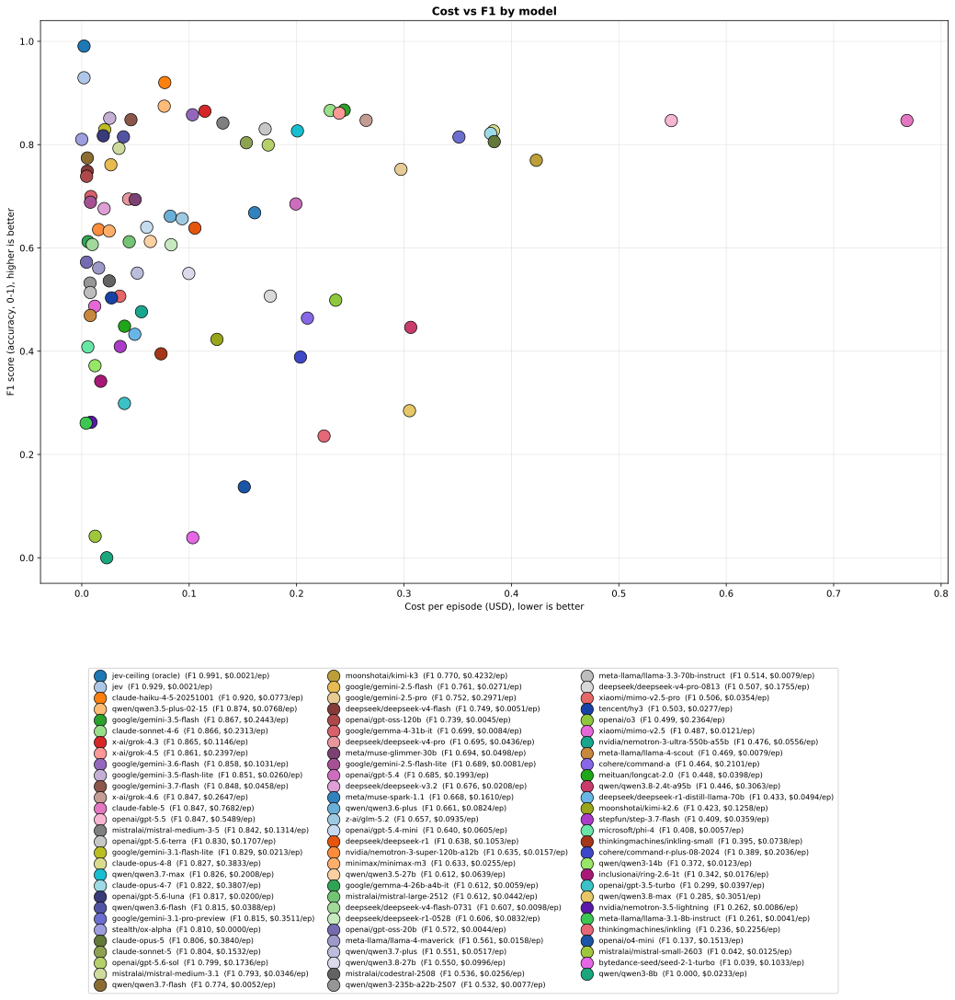

Source data: [Best Accuracy](#best-accuracy-f05--iou--05), [Best Value](#best-value-f05-per-dollar)

### Accuracy vs latency

F0.5 (y) against p50 latency (x, log scale). The cost Pareto above answers what accuracy costs in dollars; this one answers what it costs in wall-clock time. Upper-left is accurate and fast. MinusPod's pipeline is offline, so a slow accurate model is usable, but the chart shows which models make you choose and which don't. The OpenRouter latency caveat from the Metric Key applies.

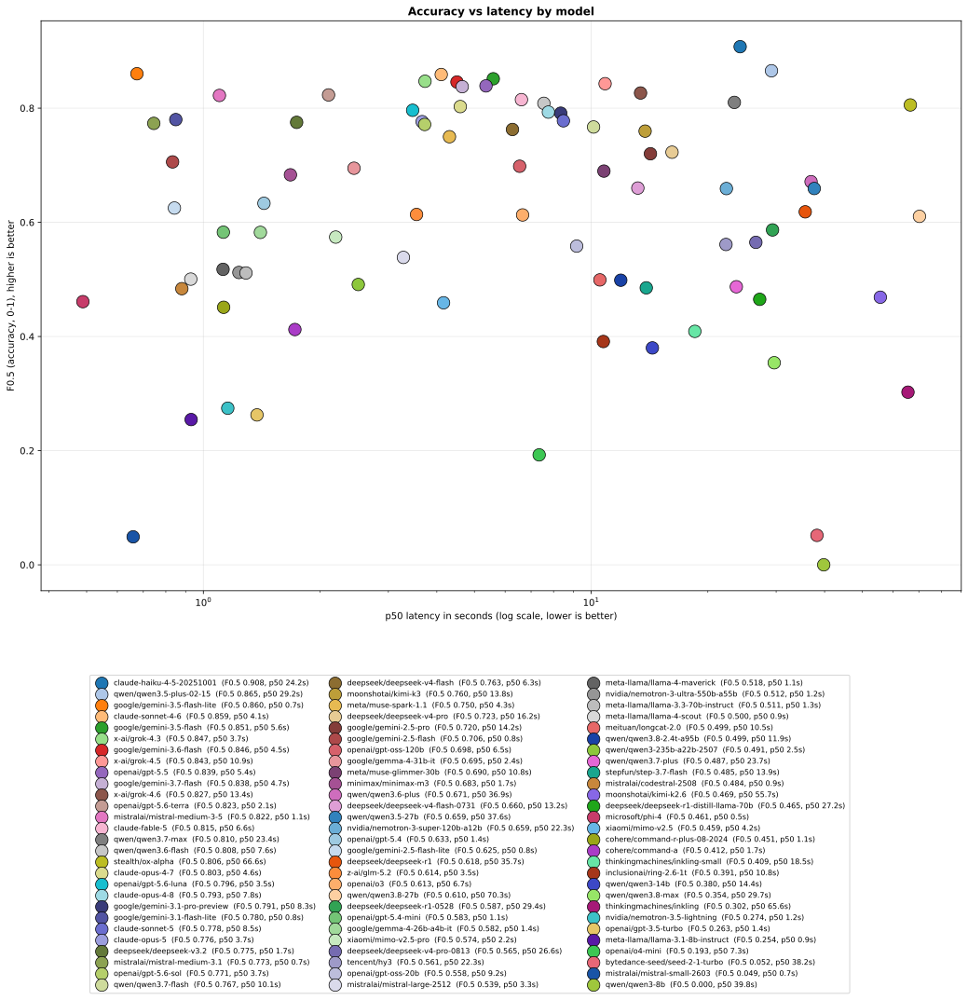

Source data: [Best Accuracy](#best-accuracy-f05--iou--05) (F0.5), [Latency tail](#latency-tail) (p50)

### JSON schema compliance

Fraction of each model's responses that parsed as a clean JSON array. 1.0 means every response came back exactly as requested; lower numbers mean the parser had to recover from markdown fences, object wrappers, or extra fields.

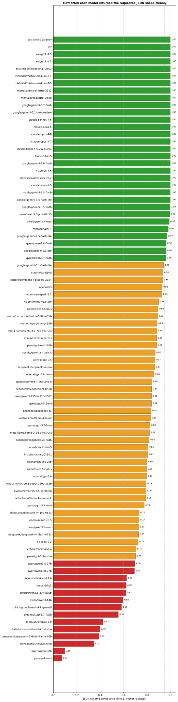

Source data: [Per-Model Detail](#per-model-detail) (`JSON compliance` field)

### F1 by episode (heatmap)

F1 score for each (model, episode) pair. Greener is more accurate, redder is less. The no-ad episodes are excluded. They have no F1 because they're PASS/FAIL negative controls.

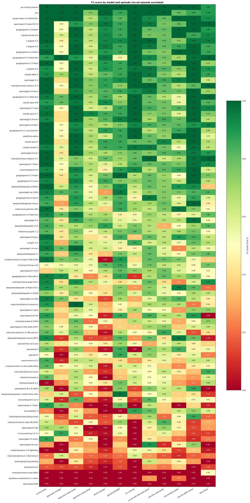

Source data: [Quick Comparison](#quick-comparison), [Per-Episode Detail](#per-episode-detail)

### Confidence calibration (heatmap)

One row per model, one column per self-reported confidence bin. Cell text is the actual hit rate at that bin plus the sample size; cell color is the calibration error (actual minus bin midpoint). Red cells mean the model claimed high confidence but was usually wrong; green is well-calibrated; blue is underconfident. Empty cells mean the model never produced a prediction in that bin. Models are sorted from most overconfident at the top to most underconfident at the bottom.

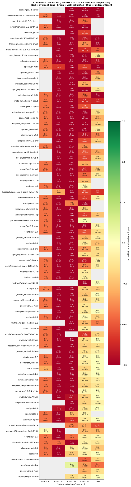

Source data: [Confidence calibration](#confidence-calibration) table

### Latency percentiles

p50, p90, p99, and max per model on a log scale. The gap between p99 and max indicates how heavy the tail is. For OpenRouter-routed models, the tail also includes upstream provider load.

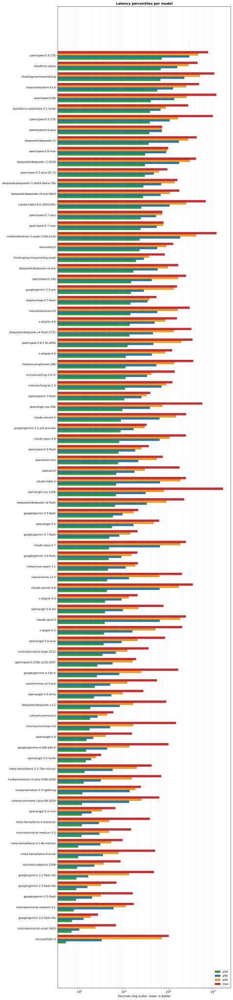

Source data: [Latency tail](#latency-tail) table

### Cross-model agreement (window distribution)

Histogram of how many models flagged at least one ad per (episode, window). The left side is windows nobody flagged (clear non-ad content), the right side is windows everyone flagged (clear sponsor reads). Bars in the middle are contested (some models said yes, some said no) and are candidates for ensemble voting or manual review. This view is anonymous (bars don't show which models contributed); the per-model breakdown is in the next chart.

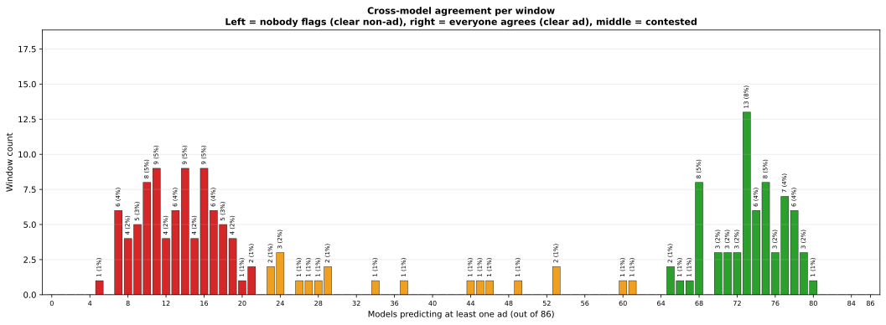

Source data: [Cross-model agreement](#cross-model-agreement) table

### Per-model alignment with majority

Stacked horizontal bar per model. Green + blue segments are windows where the model voted with the majority (true positives + true negatives); orange is windows where it voted yes but most others voted no (likely false positive / hallucination); red is windows where it voted no but most others voted yes (likely missed real ad). Right-edge label is alignment rate. High alignment means the model tracks consensus; low alignment is either insight or noise depending on whether those broken-from-consensus calls were right.

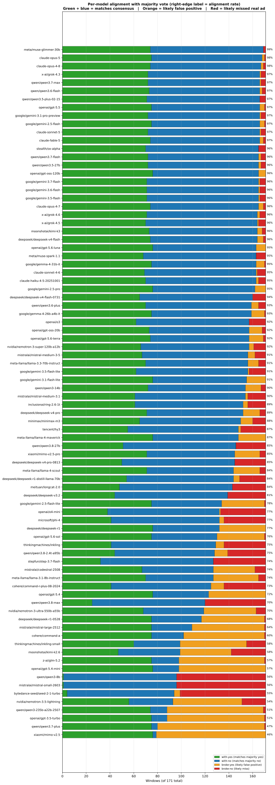

Source data: [Per-model alignment with consensus](#per-model-alignment-with-consensus) table

### Precision vs Recall (with F1 isocurves)

Scatter of precision (y) vs recall (x) for each model. Dashed gray lines are F1 isocurves; points on the same dashed line have the same F1. Top-right is ideal (high precision AND high recall). Top-left is cautious (high precision, low recall). Bottom-right is greedy (high recall, low precision). Useful for picking a model whose error profile matches your tolerance: precision-leaning for environments where false positives are expensive, recall-leaning for completeness-first.

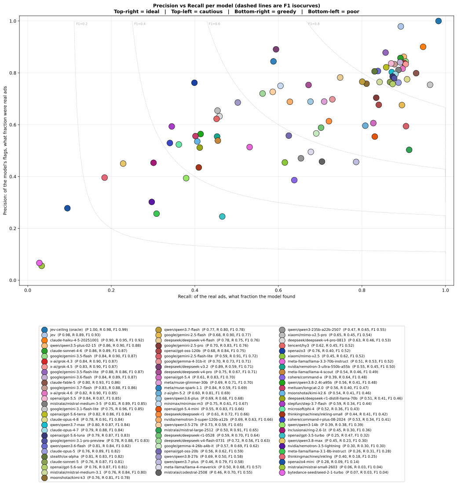

Source data: [Precision, recall, and FP/FN breakdown](#precision-recall-and-fpfn-breakdown) table

### Boundary accuracy (start + end MAE)

Stacked horizontal bars per model: blue is mean absolute error on the predicted ad START in seconds, orange is the same for END. Total error labeled at the right. Sorted by total ascending so the cleanest boundaries are at the top. Skewed bars (start much larger than end, or vice versa) mean the model systematically overshoots on one side. Relevant if you cut audio downstream.

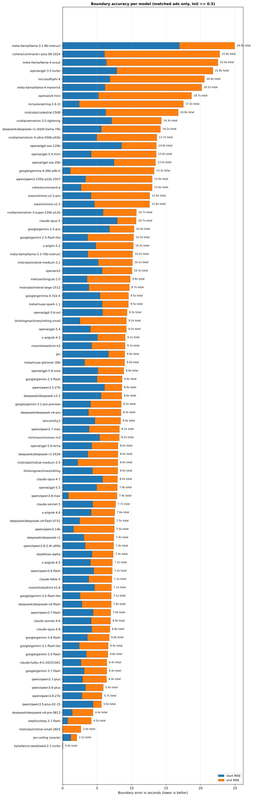

Source data: [Boundary accuracy](#boundary-accuracy) table

### Token efficiency vs F1

Scatter of output tokens per detected ad (x, log scale) vs F1 (y). Upper-left is the efficient zone: high accuracy with few output tokens. Right-side points are reasoning-heavy models that emit chain-of-thought alongside their JSON. The chart answers whether the extra tokens buy more F1 or just burn output budget. A model that lands far right at modest F1 is paying for reasoning that didn't help.

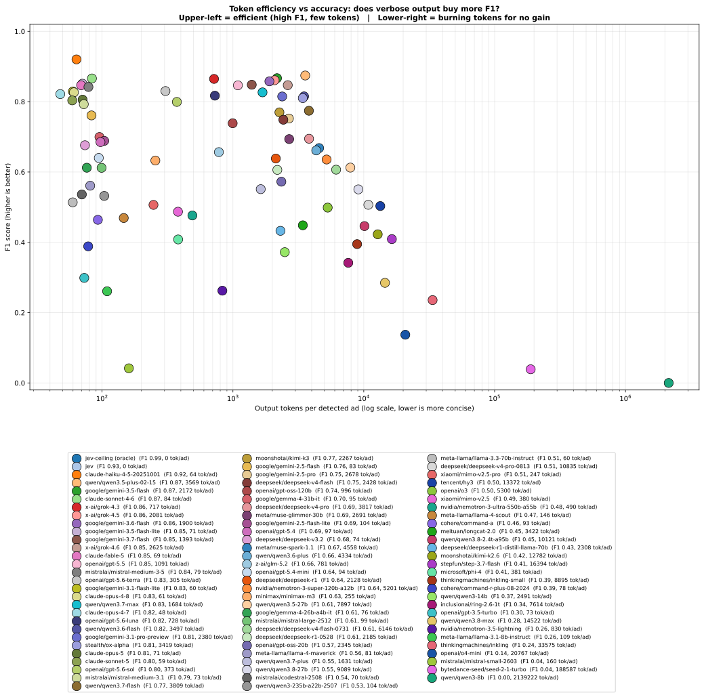

Source data: [Output token efficiency](#output-token-efficiency) table

### Cost split (input vs output)

Stacked horizontal bars per model: blue is the input share of per-episode cost, orange is the output share, total labeled at the right, sorted by total ascending. Every model reads the same transcripts, so a long blue bar is an expensive input price and a long orange bar is a talkative model. Reasoning models show up as mostly orange.

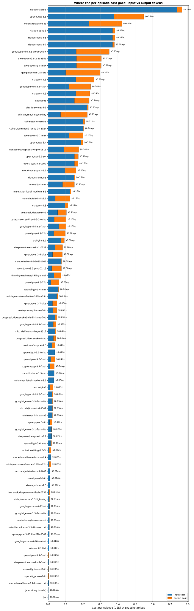

Source data: [Cost breakdown (input vs output)](#cost-breakdown-input-vs-output) table

### Trial variance (determinism check)

Horizontal bars of mean F1 stdev across episodes per model. All trials run at temperature 0.0 so well-behaved models cluster near zero. Bars are color-graded: green below 0.02 (effectively deterministic), yellow 0.02-0.05 (slight noise), red above 0.05 (single-trial F1 numbers from this model should be treated with suspicion). Dotted reference lines mark the 0.02 and 0.05 thresholds.

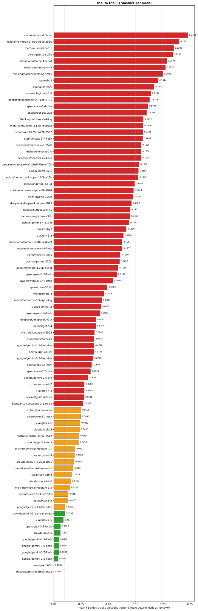

Source data: [Trial variance (determinism check)](#trial-variance-determinism-check) table

### Detection rate by ad length

Heatmap of model (row) vs ad-length bucket (column), cell = detection rate with sample size. Greener = caught more ads in that bucket; redder = missed more. Models are sorted by overall detection rate so the strongest are at the top. Empty (gray) cells mean that bucket had no truth ads for the corresponding model's trials.

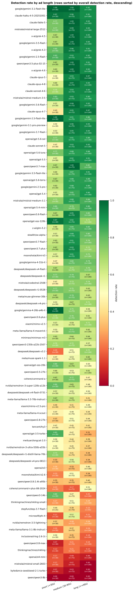

Source data: [Detection rate by ad characteristic > By ad length](#by-ad-length) table

### Detection rate by ad position

Same shape as the ad-length heatmap, but columns are episode position (pre-roll / mid-roll / post-roll). A common pattern: pre-roll is easy because of clear show-intro transitions; post-roll is harder because models near the end of long episodes often produce shorter responses or run out of context to anchor on.

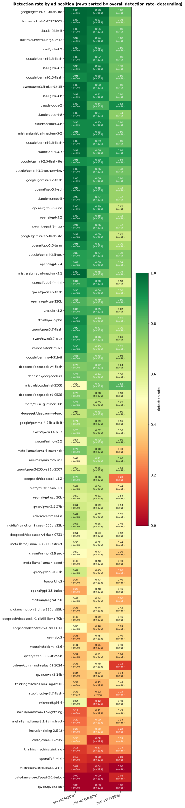

Source data: [Detection rate by ad characteristic > By ad position](#by-ad-position) table

### Parser stress (extraction-method usage)

Heatmap of model (row) vs extraction-method (column), cell = number of responses parsed via that method. Columns are ordered by total usage. `json_array_direct` is the clean path; everything else is a recovery path the parser had to take because the model added markdown fences, wrapped the array in an object, or returned malformed JSON. Models near the top of the chart use the clean path most often. They are operationally easier to consume.

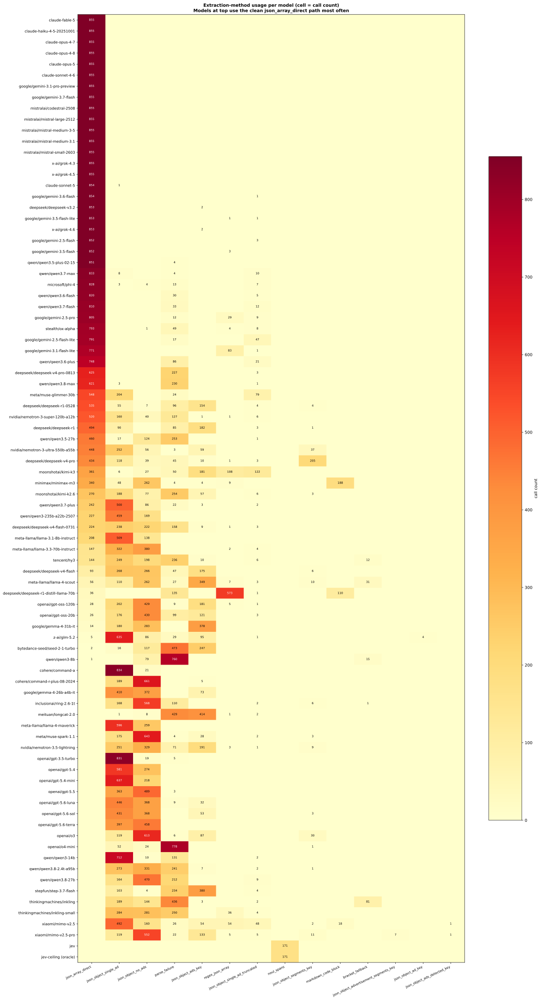

Source data: [Parser stress test](#parser-stress-test) table


## Failures and provider issues

No unresolved call errors across this run. Every (model, episode, trial, window) tuple ended with a parseable response.


## Precision, recall, and FP/FN breakdown

F1 collapses two failure modes into one number. A precision-leaning model misses ads but rarely flags non-ads; a recall-leaning model catches everything at the cost of false positives. Production tradeoffs hinge on which one you can tolerate.

### Column key

| Column | Meaning | Range |
|---|---|---|
| **TP** (true positive) | Predicted an ad and a real ad existed at that span (IoU >= 0.5) | 0 to total truth ads |
| **FP** (false positive) | Predicted an ad where no real ad existed | 0 to total predictions |
| **FN** (false negative) | Missed a real ad entirely (no prediction matched it at IoU >= 0.5) | 0 to total truth ads |
| **Precision** | `TP / (TP + FP)`. Of the ads the model claimed, how many were real? Higher means fewer false positives. | 0.000 to 1.000 |
| **Recall** | `TP / (TP + FN)`. Of the real ads, how many did the model find? Higher means fewer misses. | 0.000 to 1.000 |

Reading the table: high precision + low recall means the model is cautious. It rarely flags something that isn't an ad, but misses real ads. High recall + low precision means the opposite: catches everything but invents false positives. F1 is the harmonic mean of the two and rewards models that do both well.

| Model | Precision | Recall | TP | FP | FN |
|---|---:|---:|---:|---:|---:|
| `claude-haiku-4-5-20251001` | 0.900 | 0.937 | 230 | 27 | 15 |

## Boundary accuracy

For ads that match the truth at IoU >= 0.5, how far off were the predicted start and end timestamps? Lower is better. A model can hit F1 cleanly while still being 20s off on every boundary. Bad for any pipeline that cuts the audio.

MAE is size of the miss; bias is its direction (mean of predicted minus truth). A negative start bias or positive end bias means the cut extends past the ad and eats surrounding content; the opposite signs mean ad audio is left in. MinusPod cuts what the model flags, so a model whose bias points outward over-cuts even when its MAE looks acceptable. Bias near zero with a large MAE means the misses are random rather than systematic.

| Model | Start MAE (s) | End MAE (s) | Start bias (s) | End bias (s) |
|---|---:|---:|---:|---:|
| `claude-haiku-4-5-20251001` | 3.63 | 4.50 | +0.87 | -1.69 |

## Confidence calibration

Models include a self-reported `confidence` on each detected ad. A well-calibrated model should be right ~95% of the time when it claims 0.95 confidence. The table below bins each model's predictions and shows the actual hit rate (fraction that were true positives at IoU >= 0.5). A bin near 1.0 is well-calibrated; a low number with a high count means the model is overconfident.

| Model | 0.00-0.70 | 0.70-0.90 | 0.90-0.95 | 0.95-0.99 | 0.99+ | total |
|---|---:|---:|---:|---:|---:|---:|
| `claude-haiku-4-5-20251001` | 0.00 (n=1) | 0.43 (n=7) | 0.54 (n=13) | 0.95 (n=171) | 0.89 (n=65) | 257 |

See `report_assets/calibration.svg` for the visual reliability diagram.

## Latency tail

Median latency hides outliers. p99 and max are what determines queue depth and worst-case user wait. For OpenRouter-routed models the tail also reflects upstream provider load, not just model compute.

| Model | p50 | p90 | p95 | p99 | max |
|---|---:|---:|---:|---:|---:|
| `claude-haiku-4-5-20251001` | 16.01s | 69.51s | 85.52s | 226.93s | 452.07s |

## Output token efficiency

How many output tokens the model spent per detected ad. Lower is more concise (the model finds an ad and returns the JSON). Higher means the model is producing a lot of text the parser will discard, which costs you whether or not the answer is right.

| Model | Total output tokens | Ads detected | Tokens / ad | Cost / TP |
|---|---:|---:|---:|---:|
| `claude-haiku-4-5-20251001` | 47,158 | 784 | 60 | $0.0047 |

## Cost breakdown (input vs output)

Where each model's per-episode dollars go, at the same pricing snapshot as every other table. Every model reads the same transcripts, so the input side varies only with the provider's input price. The output side varies with how much the model writes: a high output share on a modest total usually means reasoning tokens, and a model with a low per-token price can still land mid-table by writing thousands of them. Failed calls are excluded, same as the cost column everywhere else.

| Model | Cost / episode | Input | Output | Output share |
|---|---:|---:|---:|---:|
| `claude-haiku-4-5-20251001` | $0.0773 | $0.0739 | $0.0034 | 4% |

## Trial variance (determinism check)

All trials run at temperature 0.0. If a model produces stable output you'd expect the F1 stdev across trials to be near zero. Higher numbers mean the model is non-deterministic even at temp=0. That's fine to know, but means you cannot trust a single trial's number for that model. `n/a` means the row has fewer than 2 trials on record, so a stdev is undefined rather than zero.

| Model | Mean F1 stdev across episodes | Highest single-episode stdev |
|---|---:|---:|
| `claude-haiku-4-5-20251001` | 0.0686 | 0.2236 |

## Cross-model agreement

For each of the 171 (episode, window, trial-equivalent) entries, how many of the 1 active models predicted at least one ad? High-agreement windows are unambiguous ads (or unambiguously not ads). Low-agreement windows are where individual models disagree, and are candidates for ensemble voting if you want a cheap accuracy boost.

| Models predicting an ad | Window count | Share |
|---:|---:|---:|
| 0 of 1 | 97 | 56.7% |
| 1 of 1 | 74 | 43.3% |

Read this as: rows near the top are windows where the field disagrees (most models said no, a few said yes, usually false positives); rows near the bottom are windows where the field broadly agrees (typical of clear sponsor reads).

### Per-model alignment with consensus

Same data, viewed per model. For each window, the **majority** is whether more than half of the 1 active models flagged an ad. Then for each model: did it vote with the majority or against it? Four buckets:

- **with-yes**: this model voted yes, majority also voted yes (likely true positive)
- **with-no**: this model voted no, majority also voted no (likely true negative)
- **broke-yes**: this model voted yes, majority voted no (likely false positive / hallucination)
- **broke-no**: this model voted no, majority voted yes (likely missed real ad)

Alignment rate is `(with-yes + with-no) / total`. High alignment means the model tracks the consensus; low alignment means it disagrees often, which could be brilliance or noise depending on whether its disagreements are also where its F1 wins or loses.

| Model | with-yes | with-no | broke-yes | broke-no | Alignment |
|---|---:|---:|---:|---:|---:|
| `claude-haiku-4-5-20251001` | 74 | 97 | 0 | 0 | 100.0% |

## Detection rate by ad characteristic

Aggregate detection rates often hide systematic blind spots. Below: for each model, what fraction of truth ads in each bucket were detected (matched at IoU >= 0.5).

### By ad length

Truth ads bucketed by duration: short (<30s), medium (30-90s), long (>=90s). Cell values are detection rate (fraction of truth ads in that bucket the model caught), with the sample size `n` so a misleading 1.00 on a 2-ad bucket doesn't get over-weighted. Models that systematically miss short ads usually fail on network-inserted brand-tagline spots; missing long ads is rarer and usually means the model gave up before processing the full window.

| Model | long (>=90s) | medium (30-90s) | short (<30s) |
|---|---:|---:|---:|
| `claude-haiku-4-5-20251001` | 0.94 (n=140) | 0.95 (n=75) | 0.90 (n=30) |

### By ad position

Truth ads bucketed by where they fall in the episode: pre-roll (first 10%), mid-roll (10-90%), post-roll (last 10%). Cell values are the same detection-rate-with-`n` format as ad length. A common failure pattern in our data: most models detect pre-roll and mid-roll reliably and miss post-roll, because the prompt windows near the end often catch the model mid-reasoning or with fewer transition phrases to anchor on.

| Model | pre-roll (<10%) | mid-roll (10-90%) | post-roll (>90%) |
|---|---:|---:|---:|
| `claude-haiku-4-5-20251001` | 0.97 (n=70) | 0.96 (n=125) | 0.84 (n=50) |

## Quick Comparison

One row per model, one column per episode. The headline columns (`F1`, `Cost/ep`, `p50`) summarize across all episodes; the per-episode columns let you see whether a model's average hides wide swings (a model that scores well overall might still bomb on a specific genre). The right-most `F1 stdev` column averages the per-trial standard deviations across episodes; high values mean the model isn't deterministic at temperature 0.0, so its single-trial F1 number is noisy. `Moderation blocked` is the share of attempted calls the provider refused on content grounds; those windows never reach scoring, so any non-zero value means that row's F1 was computed on a subset of the corpus and is not comparable to a row at `-`.

| Model | F1 | Cost/ep | p50 | ep-crime-junkie-8ce498f299d7 | ep-daily-gist-chicago-70a82fe93a5c | ep-daily-tech-news-show-b576979e1fe8 | ep-daily-tech-news-show-c1904b8605f7 | ep-drink-champs-30c9a2d49f13 | ep-glt1412515089-373d5ba5007b | ep-it-s-a-thing-e339179dfad6 | ep-on-air-with-dan-and-alex2-574e4f303730 | ep-security-now-audio-2850b24903b2 | ep-the-brilliant-idiots-0bb9bf634c8e | ep-the-tim-dillon-show-f62bd5fa1cfe | ep-tosh-show-5f6894439bb6 | ep-ai-cloud-essentials-e8dc897fbd6b (no-ad) | ep-oxide-and-friends-ce789ff5b62e (no-ad) | F1 stdev | Moderation blocked |
|---|---|---|---|---|---|---|---|---|---|---|---|---|---|---|---|---|---|---|---|
| `claude-haiku-4-5-20251001` | 0.915 | $0.0773 | 16.0s | 0.950 | 0.900 | 1.000 | 0.687 | 1.000 | 0.821 | 1.000 | 0.880 | 0.865 | 0.876 | 1.000 | 1.000 | PASS | PASS | 0.069 | - |

---

## Detailed Results

### Per-Model Detail

Full per-model profile: F1 averaged across episodes, total cost per episode at current pricing, p50 / p95 latency, JSON compliance, parse-failure rate, the distribution of extraction methods the parser had to use, and verbosity / truncation telemetry. The `Extraction methods` list shows how often each route was hit. `json_array_direct` is the cleanest; the rest are recovery paths. The verbosity row flags models that emit long `reason` fields or run out of token budget mid-response. Ordered by F1 descending so the best performers appear first.

#### `claude-haiku-4-5-20251001`

- F1 (avg across episodes): **0.915**
- Total cost / episode: **$0.0773**
- p50 / p95 latency: 16.01s / 85.52s
- JSON compliance: 1.00
- JSON mode: native (100% native, 855 calls)
- Parse failure rate: 0.0%
- Extraction methods: `segment_id_direct`: 855
- Verbosity: 0/855 calls over 1024 output tokens (0.0%); 0 hit max_tokens (0.0%); 0 salvaged from truncated JSON (0.0%)
- Segment category named on 784/784 detections (100%); the rest stay uncategorized (resolver: production)


### Per-Episode Detail

One subsection per episode in the corpus, showing how every model performed on that specific episode. For ad-bearing episodes you see F1 and the stdev across trials (low stdev means stable, high stdev means the model's number on this episode is noisy). For the no-ad episode you see PASS / FAIL on the negative control: PASS = zero false positives across all windows, FAIL = the model flagged something that wasn't an ad, with the count.

#### `ep-ai-cloud-essentials-e8dc897fbd6b`: How Physical AI is Streamlining Engineering

- Podcast: ai-cloud-essentials
- Duration: 16.4 min
- Truth: no-ads episode

| Model | Result | FP count |
|-------|--------|----------|
| `claude-haiku-4-5-20251001` | PASS | 0 |

#### `ep-crime-junkie-8ce498f299d7`: MISSING: Christopher “Cole” Thomas

- Podcast: crime-junkie
- Duration: 48.2 min
- Truth ads: 4

| Model | F1 | F1 stdev |
|-------|----|----------|
| `claude-haiku-4-5-20251001` | 0.950 | 0.112 |

#### `ep-daily-gist-chicago-70a82fe93a5c`: Suburban apartment market heats up

- Podcast: daily-gist-chicago
- Duration: 21.2 min
- Truth ads: 2

| Model | F1 | F1 stdev |
|-------|----|----------|
| `claude-haiku-4-5-20251001` | 0.900 | 0.224 |

#### `ep-daily-tech-news-show-b576979e1fe8`: Motorola Razr Fold is a Noble Competitor to the Galaxy Z Fold 7 - DTNS 5269

- Podcast: daily-tech-news-show
- Duration: 34.6 min
- Truth ads: 4

| Model | F1 | F1 stdev |
|-------|----|----------|
| `claude-haiku-4-5-20251001` | 1.000 | 0.000 |

#### `ep-daily-tech-news-show-c1904b8605f7`: Switch 2 Prices Rise, Forecast Drops - DTNS 5265

- Podcast: daily-tech-news-show
- Duration: 38.6 min
- Truth ads: 5

| Model | F1 | F1 stdev |
|-------|----|----------|
| `claude-haiku-4-5-20251001` | 0.687 | 0.064 |

#### `ep-drink-champs-30c9a2d49f13`: Episode 501 w/ Warren Sapp

- Podcast: drink-champs
- Duration: 258.6 min
- Truth ads: 9

| Model | F1 | F1 stdev |
|-------|----|----------|
| `claude-haiku-4-5-20251001` | 1.000 | 0.000 |

#### `ep-glt1412515089-373d5ba5007b`: #2496 - Julia Mossbridge

- Podcast: glt1412515089
- Duration: 165.3 min
- Truth ads: 4

| Model | F1 | F1 stdev |
|-------|----|----------|
| `claude-haiku-4-5-20251001` | 0.821 | 0.110 |

#### `ep-it-s-a-thing-e339179dfad6`: SOUP shots - It's a Thing 418

- Podcast: it-s-a-thing
- Duration: 26.7 min
- Truth ads: 2

| Model | F1 | F1 stdev |
|-------|----|----------|
| `claude-haiku-4-5-20251001` | 1.000 | 0.000 |

#### `ep-on-air-with-dan-and-alex2-574e4f303730`: Ryanair Wants Alcohol Bans, Emirates' $6.8B Record Profit & Buying Spirit Airlines?!

- Podcast: on-air-with-dan-and-alex2
- Duration: 58.1 min
- Truth ads: 2

| Model | F1 | F1 stdev |
|-------|----|----------|
| `claude-haiku-4-5-20251001` | 0.880 | 0.110 |

#### `ep-oxide-and-friends-ce789ff5b62e`: Mechanical Engineering at Oxide [chapter images]

- Podcast: oxide-and-friends
- Duration: 84.5 min
- Truth: no-ads episode

| Model | Result | FP count |
|-------|--------|----------|
| `claude-haiku-4-5-20251001` | PASS | 0 |

#### `ep-security-now-audio-2850b24903b2`: SN 1077: A Browser AI API? - End of Bug Bounties?

- Podcast: security-now-audio
- Duration: 156.2 min
- Truth ads: 7

| Model | F1 | F1 stdev |
|-------|----|----------|
| `claude-haiku-4-5-20251001` | 0.865 | 0.067 |

#### `ep-the-brilliant-idiots-0bb9bf634c8e`: Class Rank

- Podcast: the-brilliant-idiots
- Duration: 119.9 min
- Truth ads: 3

| Model | F1 | F1 stdev |
|-------|----|----------|
| `claude-haiku-4-5-20251001` | 0.876 | 0.137 |

#### `ep-the-tim-dillon-show-f62bd5fa1cfe`: 495 - Hantavirus Cruise & iPad Babies

- Podcast: the-tim-dillon-show
- Duration: 80.1 min
- Truth ads: 6

| Model | F1 | F1 stdev |
|-------|----|----------|
| `claude-haiku-4-5-20251001` | 1.000 | 0.000 |

#### `ep-tosh-show-5f6894439bb6`: My Mom - Emergency Pod

- Podcast: tosh-show
- Duration: 41.4 min
- Truth ads: 5

| Model | F1 | F1 stdev |
|-------|----|----------|
| `claude-haiku-4-5-20251001` | 1.000 | 0.000 |


### Parser stress test

How each model's responses were actually parsed. Columns are extraction methods, ordered alphabetically; rows are models, sorted by parse-failure rate (cleanest at top). `json_array_direct` is the happy path: a bare JSON array we could `json.loads` and process immediately. `markdown_code_block` means we had to strip triple-backtick fences first; `json_object_*` means the model wrapped the array in an outer object and we had to find the array key; `regex_*` are last-resort recovery paths. A model that needs anything but `json_array_direct` for most calls is fragile. It works today, but a small prompt change can break the parser.

| Model | segment_id_direct |
|---|---|
| `claude-haiku-4-5-20251001` | 855 |

## Methodology

Reproducibility settings used for this run. The benchmark sends the same prompts MinusPod sends in production (same system prompt, same sponsor list, same windowing) so the F1 numbers here are directly relevant to production accuracy decisions. Cost is recomputed at report time from token counts against the active pricing snapshot, so all rows compare at the same prices regardless of when the actual call ran.

- Trials per (model, episode): **5**, temperature 0.0
- max_tokens: 4096 (matches MinusPod production)
- response_format: json_object (with prompt-injection fallback when provider rejects native)
- Window size: 10 min, overlap: 3 min (imported from MinusPod's create_windows)
- Pricing snapshot: 2026-08-23T20:34:27.481692Z
- Corpus episodes: 14

## Transcript source

`segments.json` for every corpus episode is pulled byte-exact from the source MinusPod instance's `original-segments` endpoint. The transcript itself was generated by faster-whisper inside that instance, not by the benchmark. Model choice and decoding params affect what gets transcribed, which sets an upper bound on what every benchmarked LLM can find.

**Whisper config:**

| Setting | Value |
|---|---|
| Model | `large-v3` |
| Backend | local (faster-whisper, CUDA GPU) |
| Compute type | `auto` (resolves to `float16` on CUDA) |
| Language | `en` (forced English, not auto-detect) |
| VAD gap detection | on (start 3.0s / mid 8.0s / tail 3.0s) |

**`model.transcribe()` invocation** (`src/transcriber.py` as of corpus transcription, before 2.96.0):

```python
WhisperModel(model_size="large-v3", device="cuda", compute_type="auto")
model.transcribe(
    audio,
    language="en",
    initial_prompt=<podcast name + SEED_SPONSORS vocabulary>,
    beam_size=5,
    batch_size=<adaptive: 16/12/8/4 by episode length>,
    word_timestamps=True,
    vad_filter=True,
    vad_parameters={"min_silence_duration_ms": 1000, "speech_pad_ms": 600, "threshold": 0.3},
)
```

The `initial_prompt` seeded a sponsor vocabulary so Whisper produced consistent spellings (`Athletic Greens` rather than `AG1`, `ExpressVPN` rather than `express vpn`), biasing what showed up in the transcript and therefore what every benchmarked LLM is scored against. 2.96.0 removed the prompt because it dropped 7-17% of each episode's speech on the batched pipeline; the corpus has not been re-transcribed without it.

**Sponsor vocabulary** (254 canonical sponsors, 44 of them with explicit alias spellings totaling 48 aliases; from `src/utils/constants.py` `SEED_SPONSORS`). Laid out in two side-by-side groups, read top-to-bottom in each group.

| Sponsor | Aliases | Category | Sponsor | Aliases | Category |
|---|---|---|---|---|---|
| 1Password | `One Password` | tech | MacPaw | `CleanMyMac` | tech |
| Acorns | - | finance | Magic Mind | - | beverage |
| ADT | - | home | Magic Spoon | - | food |
| Affirm | - | finance_fintech | Mailchimp | - | tech_software_saas |
| Airbnb | - | travel_hospitality | Manscaped | - | personal |
| Airtable | - | tech_software_saas | MasterClass | `Master Class` | education |
| Alani Nu | - | food_beverage_nutrition | McDonald's | - | food_beverage_nutrition |
| Allbirds | - | ecommerce_retail_dtc | Mercury | - | finance_fintech |
| Alo Yoga | - | ecommerce_retail_dtc | Meter | - | b2b_startup |
| Amazon | - | retail | Midjourney | - | tech_software_saas |
| Anthropic | - | tech_software_saas | Mint Mobile | `MintMobile` | telecom |
| Apple TV+ | - | media_streaming | Miro | - | tech |
| Asana | - | tech_software_saas | Momentous | - | mental_health_wellness |
| AT&T | - | telecom | Monarch Money | - | finance |
| Athletic Brewing | - | beverage | Monday.com | `Monday` | tech |
| Athletic Greens | `AG1`, `AG One` | health | Native | - | personal |
| Audible | - | entertainment | NerdWallet | - | finance_fintech |
| Aura | - | tech | Netflix | - | media_streaming |
| Babbel | - | education | NetSuite | `Net Suite` | tech |
| BetMGM | `Bet MGM` | gambling | Noom | - | mental_health_wellness |
| BetterHelp | `Better Help` | health | NordVPN | `Nord VPN` | vpn |
| Betterment | - | finance | Notion | - | tech |
| Bill.com | - | finance_fintech | Nutrafol | - | health |
| Birchbox | - | ecommerce_retail_dtc | Okta | - | tech_software_saas |
| Bitwarden | `Bit Warden` | tech | OLIPOP | - | food_beverage_nutrition |
| Blinkist | - | education | OneSkin | `One Skin` | personal |
| Bloom Nutrition | - | food_beverage_nutrition | OpenAI | - | tech_software_saas |
| Blue Apron | - | food | Outdoor Voices | - | ecommerce_retail_dtc |
| Bombas | - | apparel | OutSystems | - | tech |
| Booking.com | - | travel_hospitality | PagerDuty | - | b2b_startup |
| Bose | - | electronics | Paramount+ | - | media_streaming |
| Brex | - | finance_fintech | Patreon | - | tech_software_saas |
| Brilliant | - | tech_software_saas | Perplexity | - | tech_software_saas |
| Brooklinen | - | home | Plaid | - | finance_fintech |
| Butcher Box | `ButcherBox` | food | PolicyGenius | `Policy Genius` | finance |
| CacheFly | - | tech | Poppi | - | food_beverage_nutrition |
| Caesars Sportsbook | - | gaming_sports_betting | Poshmark | - | ecommerce_retail_dtc |
| Calm | - | health | Progressive | - | finance |
| Canva | - | tech | Public.com | - | finance_fintech |
| Capital One | - | finance | Pura | - | home_security |
| Care/of | `Care of`, `Careof` | health | Purple | - | home |
| CarMax | `Car Max` | auto | QuickBooks | - | finance_fintech |
| Carvana | - | auto | Quince | - | apparel |
| Casper | - | home | Quip | - | personal |
| Cerebral | - | mental_health_wellness | Ramp | - | finance_fintech |
| Chime | - | finance_fintech | Raycon | - | electronics |
| ClickUp | - | tech_software_saas | Retool | - | tech_software_saas |
| Cloudflare | - | tech_software_saas | Ring | - | home |
| Coinbase | - | finance_fintech | Rippling | - | b2b_startup |
| Comcast | - | telecom | Ritual | - | health |
| Cozy Earth | - | home | Ro | - | mental_health_wellness |
| Credit Karma | - | finance | Robinhood | - | finance_fintech |
| CrowdStrike | - | tech_software_saas | Rocket Lawyer | - | insurance_legal |
| Cursor | - | tech_software_saas | Rocket Money | `RocketMoney`, `Truebill` | finance |
| Databricks | - | tech_software_saas | Roman | - | health |
| Datadog | - | tech_software_saas | Rosetta Stone | - | education |
| Deel | - | business | Rothy's | - | ecommerce_retail_dtc |
| DeleteMe | `Delete Me` | tech | Saatva | - | ecommerce_retail_dtc |
| Disney+ | - | media_streaming | Salesforce | - | tech_software_saas |
| DocuSign | - | tech_software_saas | SeatGeek | - | gaming_sports_betting |
| Dollar Shave Club | `DSC` | personal | Seed | - | health |
| DoorDash | `Door Dash` | food | SendGrid | - | tech_software_saas |
| DraftKings | `Draft Kings` | gambling | ServiceNow | - | tech_software_saas |
| Duolingo | - | tech_software_saas | Shein | - | ecommerce_retail_dtc |
| eBay Motors | - | auto | Shopify | - | tech |
| Eight Sleep | - | mental_health_wellness | SimpliSafe | `Simpli Safe` | home |
| ElevenLabs | - | tech_software_saas | SiriusXM | - | media_streaming |
| ESPN Bet | - | gaming_sports_betting | Skillshare | - | tech_software_saas |
| Everlane | - | ecommerce_retail_dtc | SKIMS | - | ecommerce_retail_dtc |
| EveryPlate | - | food_beverage_nutrition | Skyscanner | - | travel_hospitality |
| Expedia | - | travel_hospitality | Slack | - | tech_software_saas |
| ExpressVPN | `Express VPN` | vpn | Snowflake | - | tech_software_saas |
| FabFitFun | - | ecommerce_retail_dtc | SoFi | - | finance |
| Factor | - | food | Spaceship | - | tech |
| FanDuel | `Fan Duel` | gambling | Splunk | - | b2b_startup |
| Figma | - | tech_software_saas | Spotify | - | media_streaming |
| Ford | - | auto | Squarespace | `Square Space` | tech |
| Framer | - | tech | Stamps.com | `Stamps` | business |
| FreshBooks | - | finance_fintech | Starbucks | - | food_beverage_nutrition |
| Function Health | - | mental_health_wellness | State Farm | - | finance |
| Function of Beauty | - | personal | Stitch Fix | - | ecommerce_retail_dtc |
| Gametime | `Game Time` | entertainment | StockX | - | ecommerce_retail_dtc |
| Geico | - | finance | Stripe | - | finance_fintech |
| GitHub | - | tech_software_saas | StubHub | - | gaming_sports_betting |
| GitHub Copilot | - | tech_software_saas | Substack | - | tech_software_saas |
| GOAT | - | ecommerce_retail_dtc | T-Mobile | `TMobile` | telecom |
| GoodRx | `Good Rx` | health | Talkspace | - | mental_health_wellness |
| Gopuff | - | ecommerce_retail_dtc | Temu | - | ecommerce_retail_dtc |
| Grammarly | - | tech | Ten Thousand | - | ecommerce_retail_dtc |
| Green Chef | `GreenChef` | food | Thinkst Canary | - | tech |
| Grubhub | `Grub Hub` | food | Thorne | - | mental_health_wellness |
| Gusto | - | b2b_startup | ThreatLocker | - | tech |
| Harry's | `Harrys` | personal | ThredUp | - | ecommerce_retail_dtc |
| HBO Max | - | media_streaming | Thrive Market | - | food |
| Headspace | `Head Space` | health | Toyota | - | auto |
| Helix Sleep | `Helix` | home | Transparent Labs | - | food_beverage_nutrition |
| HelloFresh | `Hello Fresh` | food | Turo | - | automotive_transport |
| Hers | - | health | Twilio | - | tech_software_saas |
| Hims | - | health | Uber | - | automotive_transport |
| Honeylove | `Honey Love` | apparel | Uber Eats | `UberEats` | food |
| Hopper | - | travel_hospitality | UnitedHealth Group | - | finance_fintech |
| HubSpot | `Hub Spot` | tech | Vanta | - | tech |
| Huel | - | food_beverage_nutrition | Veeam | - | tech |
| Hyundai | - | auto | Vercel | - | tech_software_saas |
| iHeartRadio | - | media_streaming | Verizon | - | telecom |
| Imperfect Foods | - | food_beverage_nutrition | Visible | - | telecom |
| Incogni | - | tech | Vrbo | - | travel_hospitality |
| Indeed | - | jobs | Vuori | - | ecommerce_retail_dtc |
| Inside Tracker | - | mental_health_wellness | Warby Parker | - | ecommerce_retail_dtc |
| Instacart | - | food | Wayfair | - | ecommerce_retail_dtc |
| Intuit | - | finance_fintech | Waymo | - | automotive_transport |
| Joovv | - | mental_health_wellness | Wealthfront | - | finance |
| Kayak | - | travel_hospitality | WebBank | - | finance_fintech |
| Klarna | - | finance_fintech | Webflow | - | b2b_startup |
| Klaviyo | - | tech_software_saas | WhatsApp | - | tech |
| LegalZoom | - | insurance_legal | WHOOP | - | mental_health_wellness |
| Lemonade | - | finance | Workday | - | tech_software_saas |
| Levels | - | mental_health_wellness | Xero | - | finance_fintech |
| Liberty Mutual | - | finance | YouTube | - | media_streaming |
| Lime | - | automotive_transport | YouTube TV | - | media_streaming |
| Linear | - | tech_software_saas | Zapier | - | tech |
| LinkedIn | `LinkedIn Jobs` | jobs | Zendesk | - | tech_software_saas |
| Liquid IV | `Liquid I.V.` | health | ZipRecruiter | `Zip Recruiter` | jobs |
| LMNT | `Element` | health | ZocDoc | `Zoc Doc` | health |
| Loom | - | tech_software_saas | Zoom | - | tech_software_saas |
| Lululemon | - | ecommerce_retail_dtc | Zscaler | - | tech |
| Lyft | - | automotive_transport | Zyn | `ZYN`, `Zinn` | tobacco_nicotine |

**Mishearing corrections** (174 entries, from `src/utils/constants.py` `SPONSOR_ALIASES`). Applied post-transcription to normalize Whisper output toward the canonical sponsor name. Distinct from the `aliases` column above, which lists intentional alternative spellings (e.g. `AG1` vs `Athletic Greens`); the entries below are mostly Whisper mishearings (e.g. `a firm` -> `Affirm`, `xerox` -> `Xero`). Laid out in three side-by-side groups, read top-to-bottom in each group.

| Heard as | Normalized to | Heard as | Normalized to | Heard as | Normalized to |
|---|---|---|---|---|---|
| `1 password` | 1Password | `good-rx` | GoodRx | `patron` | Patreon |
| `8 sleep` | Eight Sleep | `green chef` | Green Chef | `pay tree on` | Patreon |
| `8-sleep` | Eight Sleep | `green-chef` | Green Chef | `perplexity ai` | Perplexity |
| `a firm` | Affirm | `greenchef` | Green Chef | `perplexity-ai` | Perplexity |
| `a g one` | Athletic Greens | `grub hub` | Grubhub | `policy genius` | PolicyGenius |
| `ag 1` | Athletic Greens | `grub-hub` | Grubhub | `policy-genius` | PolicyGenius |
| `ag one` | Athletic Greens | `harrys` | Harry's | `pyura` | Pura |
| `ag1` | Athletic Greens | `head space` | Headspace | `ray con` | Raycon |
| `athlean x` | Athlean-X | `head-space` | Headspace | `ray-con` | Raycon |
| `athlean-x` | Athlean-X | `hello fresh` | HelloFresh | `re tool` | Retool |
| `athletic greens one` | Athletic Greens | `hello-fresh` | HelloFresh | `ro gain` | Rogaine |
| `athleticgreens` | Athletic Greens | `him's` | Hims | `ro-gaine` | Rogaine |
| `bet mgm` | BetMGM | `hims & hers` | Hims & Hers | `rocket money` | Rocket Money |
| `bet-mgm` | BetMGM | `hims and hers` | Hims & Hers | `rocket-money` | Rocket Money |
| `better help` | BetterHelp | `honey love` | Honeylove | `rocketlawyer` | Rocket Lawyer |
| `better-help` | BetterHelp | `honey-love` | Honeylove | `rocketmoney` | Rocket Money |
| `birch box` | Birchbox | `honeylove` | Honeylove | `rocketmortgage` | Rocket Mortgage |
| `birch-box` | Birchbox | `hub spot` | HubSpot | `seat geek` | SeatGeek |
| `bit warden` | Bitwarden | `hub-spot` | HubSpot | `seat-geek` | SeatGeek |
| `bit-warden` | Bitwarden | `hubs pot` | HubSpot | `shop a fly` | Shopify |
| `blueapron` | Blue Apron | `imperfect foods` | Imperfect Foods | `shop fly` | Shopify |
| `brecks` | Brex | `imperfectfoods` | Imperfect Foods | `shop ify` | Shopify |
| `butcher box` | Butcher Box | `insta cart` | Instacart | `simpli safe` | SimpliSafe |
| `butcher-box` | Butcher Box | `insta-cart` | Instacart | `simpli-safe` | SimpliSafe |
| `butcherbox` | Butcher Box | `l m n t` | LMNT | `simply safe` | SimpliSafe |
| `car max` | CarMax | `legal zoom` | LegalZoom | `sky scanner` | Skyscanner |
| `car-max` | CarMax | `legal-zoom` | LegalZoom | `sky-scanner` | Skyscanner |
| `cloud flare` | Cloudflare | `legalzoom` | LegalZoom | `so fi` | SoFi |
| `cloud-flare` | Cloudflare | `liquid i v` | Liquid IV | `so-fi` | SoFi |
| `co pilot` | GitHub Copilot | `liquid i.v.` | Liquid IV | `square space` | Squarespace |
| `co-pilot` | GitHub Copilot | `liquid iv` | Liquid IV | `square-space` | Squarespace |
| `copilot` | GitHub Copilot | `liquidiv` | Liquid IV | `stamp dot com` | Stamps.com |
| `creditkarma` | Credit Karma | `magic mind` | Magic Mind | `stitch fix` | Stitch Fix |
| `delete me` | DeleteMe | `magic spoon` | Magic Spoon | `stitch-fix` | Stitch Fix |
| `delete-me` | DeleteMe | `magicmind` | Magic Mind | `stitchfix` | Stitch Fix |
| `dollarshaveclub` | Dollar Shave Club | `magicspoon` | Magic Spoon | `stub hub` | StubHub |
| `door dash` | DoorDash | `master class` | MasterClass | `stub-hub` | StubHub |
| `door-dash` | DoorDash | `master-class` | MasterClass | `sub stack` | Substack |
| `draft kings` | DraftKings | `mercury bank` | Mercury | `sub-stack` | Substack |
| `draft-kings` | DraftKings | `mercury-bank` | Mercury | `thrive market` | Thrive Market |
| `eight-sleep` | Eight Sleep | `mint mobile` | Mint Mobile | `thrivemarket` | Thrive Market |
| `eightsleep` | Eight Sleep | `mint-mobile` | Mint Mobile | `transparent labs` | Transparent Labs |
| `element` | LMNT | `mintmobile` | Mint Mobile | `transparentlabs` | Transparent Labs |
| `every plate` | EveryPlate | `monarch money` | Monarch Money | `uber eats` | Uber Eats |
| `every-plate` | EveryPlate | `monarch-money` | Monarch Money | `uber-eats` | Uber Eats |
| `express vpn` | ExpressVPN | `monarchmoney` | Monarch Money | `ubereats` | Uber Eats |
| `express-vpn` | ExpressVPN | `my protein` | Myprotein | `ver cell` | Vercel |
| `fab fit fun` | FabFitFun | `my ro` | Miro | `ver sel` | Vercel |
| `fab-fit-fun` | FabFitFun | `myprotein` | Myprotein | `wealth front` | Wealthfront |
| `fan duel` | FanDuel | `net suite` | NetSuite | `wealth-front` | Wealthfront |
| `fan-duel` | FanDuel | `net-suite` | NetSuite | `woop` | Whoop |
| `game time` | Gametime | `nord vpn` | NordVPN | `xerox` | Xero |
| `game-time` | Gametime | `nord-vpn` | NordVPN | `zero` | Xero |
| `gametime` | Gametime | `one password` | 1Password | `zip recruiter` | ZipRecruiter |
| `github-copilot` | GitHub Copilot | `one skin` | OneSkin | `zip-recruiter` | ZipRecruiter |
| `go puff` | Gopuff | `one-password` | 1Password | `zoc doc` | ZocDoc |
| `go-puff` | Gopuff | `one-skin` | OneSkin | `zoc-doc` | ZocDoc |
| `good rx` | GoodRx | `p ninety x` | P90X | `zock doc` | ZocDoc |

## Run Metadata

- Report generated: 2026-09-19T06:00:44Z
- Unique work units (current state, last-write-wins after retries): 855
- Successful: 855
- Failed: 0
- Lifetime list-price cost (sum of at-runtime costs, includes superseded rows): $5.4088
- Lifetime tokens (same basis): 5,173,055 in + 47,158 out = 5,220,213
- Note: every input token is priced at list rate. Providers that serve a repeated prompt from cache bill less than this, and the harness does not record cache hits, so a real invoice for this run will come in under the figure above.
- Active pricing snapshot: 2026-08-23T20:34:27.481692Z
- Addressing mode: segment_ids
- System prompt: live (sha256:7652e74a)
