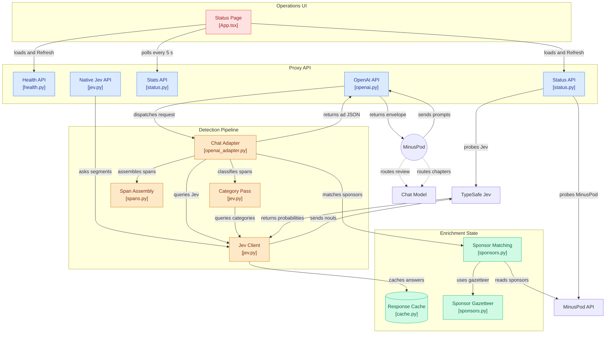

# How it works

[< Documentation index](README.md) | [Project README](../README.md)

## Contents

- [Request flow](#request-flow)
- [Supported MinusPod phases](#supported-minuspod-phases)
- [Architecture](#architecture)
- [Repository layout](#repository-layout)

## Request flow

Jev scores one segment at a time ("is this line an ad?"); the client assembles the spans. The proxy wraps that as an OpenAI chat endpoint:

1. Parse MinusPod's window prompt into segments.
2. Ask Jev one noul per segment.
3. Assemble spans and run a second pass for category.
4. Name sponsors from MinusPod's sponsor list, with a gazetteer fallback.
5. Return the `{"ads": [...]}` JSON in a chat-completion envelope.

## Supported MinusPod phases

One `/chat/completions` handler covers three of MinusPod's four LLM phases:

- **detection**: the window prompt.
- **verification**: re-detection on the re-cut audio, same prompt, handled identically.
- **review**: per-ad prompts (marked `>>> CANDIDATE AD START` / `<<< CANDIDATE AD END`) get Jev's verdict schema (is_ad, boundaries, confidence), including resurrection candidates.

Jev Proxy does not support chapter generation. Configure a secondary chat-model provider and set `chapters_provider` to `secondary`; do not route chapter generation to this proxy.

## Architecture

## Repository layout

- `backend/app/`: the proxy, with `api/` routers and `services/` for Jev calls, detection, review, sponsors, and `openai_adapter.py` for prompt parsing and the ads/verdict envelope.
- `compat/minuspod_compat/`: vendored MinusPod code shared by the proxy and benchmark.
- `benchmark/`: the evaluation harness, corpus, caches, and reports.
- `frontend/`, `deployment/`, `docker-compose.yml`: status page and container stack.
- `JEV_BENCHMARK_REPORT.md`: the test report.
