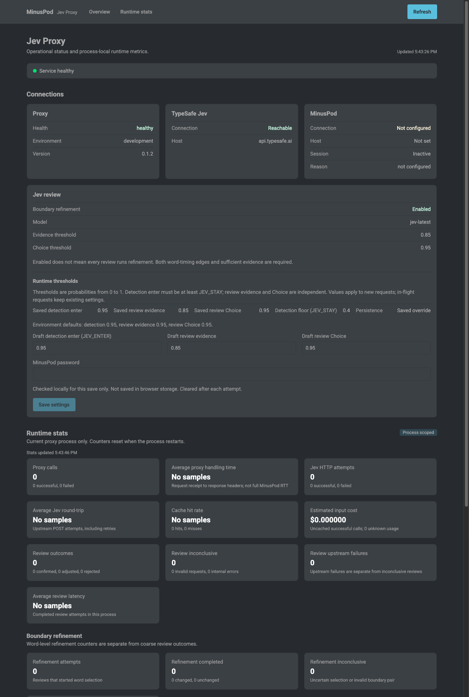

# Web interface

[< Documentation index](README.md) | [Project README](../README.md)

## Contents

- [Status page](#status-page)
- [Review settings](#review-settings)
- [Runtime statistics](#runtime-statistics)

## Status page

The status page is served at the proxy root, `http://<proxy>:8080/`. It has an Overview and a Runtime stats view. Runtime stats refresh every 5 seconds. Manual Refresh probes health and status; after a successful probe, it refreshes stats.

*Local test instance showing a saved example override; thresholds and runtime statistics are not defaults or live production data.*

- **Connections**: four cards for Proxy (health, environment, version), TypeSafe Jev (connection, host), MinusPod (connection, host, session), and Jev review settings.
- **Review settings**: shows effective thresholds and lets an authenticated operator edit them. Boundary refinement ranks timed edges, then validates the complete proposed cut with a focused NouL. Draft values survive status refreshes. The password is cleared after each save attempt and is not saved in browser storage.
- **Runtime stats**: process-scoped counters from `/api/stats`: proxy calls, average proxy handling time, Jev HTTP attempts, average Jev round-trip, cache hit rate, estimated input cost, process uptime, and configured workers. Changed counts are recommendations, not confirmed applied cuts. MinusPod may clamp or reject them to protect DAI cores. Counters reset when the process restarts and are per process, not a container-wide total.
- **Review reasons**: `transcript_gap` counts candidates that still overlap no segment after word-timing recovery. These return `422` without a Jev call or boundary-selection attempt.

The page calls `/api/health`, `/api/status`, `/api/settings`, and `/api/stats` directly. It reports live reachability and performs no inference or MinusPod login.

## Review settings

- The page reads `GET /api/settings` and saves all four editable thresholds atomically with `PUT /api/settings`.
- Saving requires `Authorization: Bearer <MinusPod password>`. The proxy checks that password locally and does not log in to MinusPod.
- Without `MINUSPOD_PASSWORD`, settings are visible but not editable.

Full threshold defaults and persistence behavior are in [Configuration](configuration.md).

## Runtime statistics

Statistics are process-scoped. Docker defaults to one worker, so its totals describe the container. With more than one worker, the response is not a container-wide aggregate. See [API](api.md) for metric definitions and caveats.
